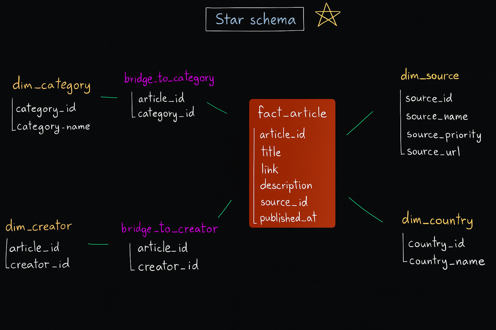

# Overview
 

This project involves developing an ETL pipeline to extract data from the source (news.io), transform it, and load it into a Data Lake or Data Warehouse (S3 bucket/Redshift). The final dataset is prepared for downstream use in statistical analysis, machine learning models, and other data-driven applications.

# Dag graph


Step 1: Fetch and Upload Raw Data
- The process starts by fetching data from News.io as JSON files.
- These files are then uploaded to a pre-configured S3 bucket.

Step 2: Convert JSON to CSV
- The JSON files are retrieved from the S3 bucket.
- Each JSON file is converted into a CSV format and uploaded to another directory within the same bucket.

Step 3: Clean the Data
- This step involves data cleaning:
    - Remove unnecessary columns
    - Eliminate duplicate rows
    - Extract article creator names using "Spacy", the NLP library

----------------- 🟰 Steps 4 and 5 Run in Parallel -----------------

Step 4: Load into Redshift Staging Table
- The cleaned CSV files are copied into a staging table in Redshift.
- Then, the data is moved into a main table in Redshift.
- The purpose of the staging table is to filter out duplicates before inserting into the main table.



Step 5: Load into Star Schema
- First, design your star schema in Redshift (with dimension and fact tables).
- Next, split the cleaned CSV into multiple parts according to your schema.
- Load each part into its corresponding table in Redshift.
- Since Redshift doesn’t enforce uniqueness constraints, Python is used to handle deduplication before inserting.

# 🛠 Installation

### Step 1: install docker desktop 
following steps provided on these links
- Window: https://docs.docker.com/desktop/setup/install/windows-install/
- Mac: https://docs.docker.com/desktop/setup/install/mac-install/
- Linux: https://docs.docker.com/desktop/setup/install/linux/

---

### Step 2: build airflow image 
in project directory run:
```
docker build . --tag extending_airflow:latest
```
📝 Rebuild the image whenever you change something in ```requirements.txt```

---

### Step 3: Start Airflow 
in project directory run: 
```
docker compose up -d
```
⚠️ (don't forget to open docker dasboard before running this)

---

### Step 4: go to ```0.0.0.0:8080``` | 🎉 That’s it!!
